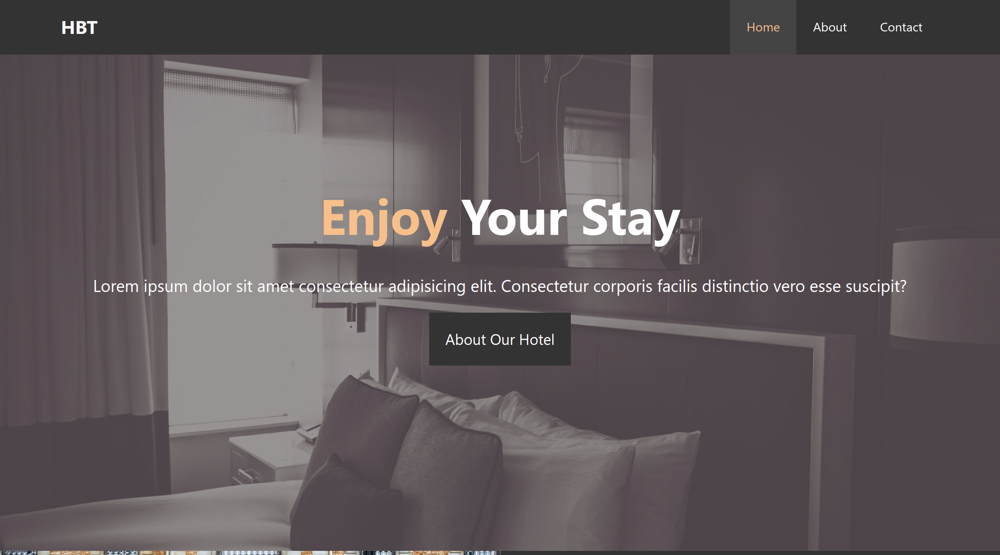
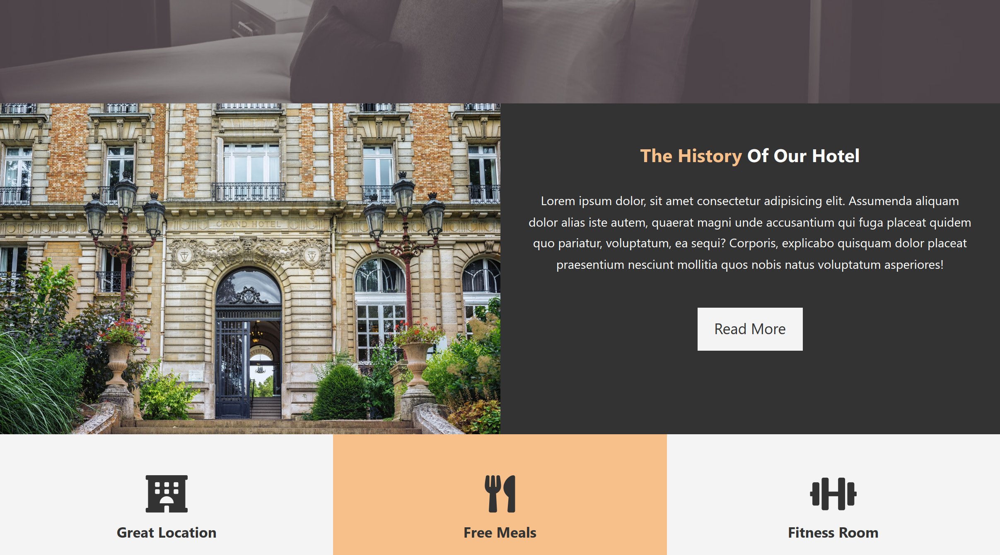
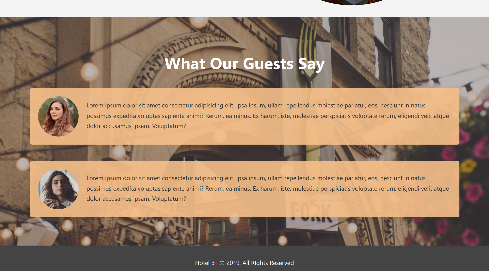

# Hotel Website Project Practice

A simple Hotel Website for front end practice based on only raw html and css.

The key agenda is to learn the basics of html and css through implementation of this small project.

---

# What I learned while building this website

* [x] Getting familiar with basic html tags
* [x] Uses of attributes in tags
* [x] Uses of classes and ids and how to name. (There is still scope of improvement for me on how to name them)
* [x] Basics of css
* [x] Uses of paddings, margins and other attributes
* [x] Uses of floating properties
* [x] Making website a little bit interactive with the help of pseudo classes

---

# Screenshots

---

# What's next?

* [ ] Make it more responsive
* [ ] Maybe try implementing flexbox and grid wherever appropriate?
* [ ] Add a little bit Javascript to make it a bit more interactive